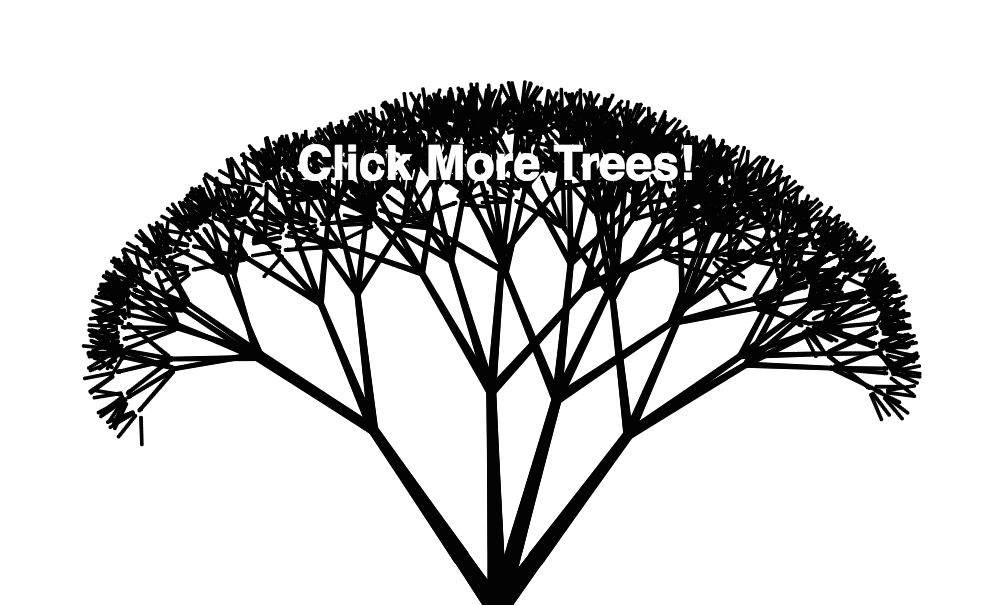

--***Please note this application was made in 2016 and is not a current reflection of my skills***--

## Tree Generator

[Live Demo][github-pages]

[github-pages]: http://gregferg.github.io/tree_generator/

Create Trees by clicking! The further up on the screen you click the larger the tree.

###Features

#### Tree Algorithm

The algorithm creates a root node, which creates all the rest of the tree. Each node has 4 children, until there have been 4 iterations of children. Node connectors are made to draw the paths (branches) from a parent node to it's children. As soon as the connectors have reached their child nodes, that child node then generates 4 children nodes and again creates node connectors to draw the path to them. The radius of these node connectors reduces as the continue through the tree to the leaves.

###### Future Features

* Add slider bars to change how the algorithm is visualized
* Add a revert to default button
